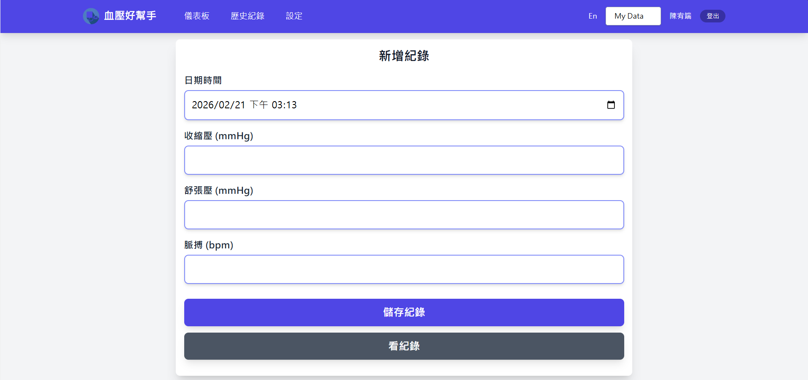

import newSample from "./new-sample.png";
import oldSample from "./old-sample.png";
import navigationSample from "./navigation-sample.jpg";
import onePage from "./one-page.jpg";
import sample1 from "./sample1.jpg";
import sample2 from "./sample2.jpg";

### 立刻使用，完全免費:

[https://bp-together.rduan.org](https://bp-together.rduan.org)

{/*  */}

# 專案緣起:

家族中有高血壓病史，家中長輩大多都需要監測血壓，但市面上的血壓紀錄 App 大多需要付費，且對長輩來說介面不友善，因此決定開發一個免費且簡單易用的血壓紀錄系統，讓家人可以輕鬆記錄血壓數據，並且分享給親友，還可以設定血壓過高的警告通知。

# 需求

## 1. 痛點

- 大多數系統分享功能需要付費
- 介面對高齡使用者不友善
- 無法設定血壓警告通知
- 分享機制不完整

## 2. 附加期待
- 盡可能地使用較小的規模，以控制預算還有維護的成本
- 盡可能地使用免費且現成的服務
- 快速的開發

# 研究心得:
> 在這個章節中，我將分享我在開發這個專案過程中，對於長輩使用者的研究心得，以及在設計和實作過程中所遇到的挑戰和解決方案。
## 關於 UI: 長輩們喜歡的介面是甚麼?

經過觀察自家阿嬤的使用習慣，我得出長輩們喜歡的介面具有以下的特色

### 1. 極為精簡的頁面設計

> 任何多餘的文字、UI 元素，都將為長輩帶來困惑

  <figure class="flex flex-col items-center">
    
    <figcaption class="mt-2 text-sm text-gray-500 font-medium">
      舊版，有多餘的文字引導，對長輩來說反而造成困擾
    </figcaption>
  </figure>

  <figure class="flex flex-col items-center">
    
    <figcaption class="mt-2 text-sm text-blue-600 font-bold">
      新版，極為精簡的設計，去除多餘的文字引導，更適合長輩使用
    </figcaption>
  </figure>

我們現在的設計，習慣使用文字引導使用者操作，但對長輩來說，這些文字反而會造成困擾，因此最好去除這些多餘的資訊。  
在先前的系統，我會加上 placeholder 來告訴使用者需要輸入甚麼，但對長輩來說，這些 placeholder 反而會造成困擾，使得他們沒有辦法意識到這些 placeholder 是需要被替換的，因此，我們應該將其去除

### 2. 按鈕導覽(Button Navigation)

每多一個操作，對長輩來說就多一個困難，因此我們應該盡可能的減少操作步驟。
經過觀察自家的阿嬤，我發現或許是因為皮膚乾燥的關係，導致她的觸控不太靈敏，因此在設計上，我們應該盡可能的減少操作步驟，特別是"滑動"的操作。

  <figure class="flex flex-col items-center">
    
    <figcaption class="mt-2 text-sm text-gray-500 font-medium text-center">
      使用按鈕來導航
    </figcaption>
  </figure>

  <figure class="flex flex-col items-center">
    
    <figcaption class="mt-2 text-sm text-blue-600 font-bold text-center">
      將主要功能放在同一個頁面
    </figcaption>
  </figure>

同時，我們應該將主要的功能全部都放在同一個頁面，讓長輩不需要"滑動"，以減少操作的困難度。

### 3. 好看不一定重要:

對於長輩的 APP 來說，好看不一定重要，反而是好用才是最重要的。  
我曾經花了比較多的時間來製作一個漂亮的 UI ，但是後來發現長輩們並不懂得"欣賞"這些 UI 的美感，反而是簡單、清晰的設計更受他們的喜愛，因此在設計上，我們應該以"好用"為優先考量，而不是"好看"。

### 4. 不是所有的頁面都需要為長輩設計

  <figure class="flex flex-col items-center">
    
    <figcaption class="mt-2 text-sm font-medium text-center">
      血壓警告設定頁面
    </figcaption>
  </figure>

  <figure class="flex flex-col items-center">
    
    <figcaption class="mt-2 text-sm  font-medium text-center">
      分享權限設定頁面
    </figcaption>
  </figure>

雖然這個 APP 是為了長輩而設計的，但並不是所有的頁面都需要為長輩設計，特別是設定頁面，這些頁面通常是由年輕人來操作的，因此在這些頁面上，我們可以使用比較現代化的設計。

## 訊息推送功能:

### 1. 為什麼訊息功能很重要??

經過我的研究發現，家族的成員並不常主動進入系統查看長輩的血壓紀錄，比起主動查看，家族成員更傾向被動的推送訊息。

而本系統可以手動的設定血壓警告的門檻值，當長輩的血壓紀錄超過這個門檻值時，系統就會自動的推送訊息給家族成員，讓他們可以即時的知道長輩的血壓狀況，並且主動關心，或者是評估是否需要帶長輩去看醫生。

### 2. 為甚麼要使用 Firebase Cloud Messaging??

一開始的時候，原本是想要自己實作訊息推送的功能，但後來發現這個功能的實作相當複雜，特別是要考慮到不同平台的相容性問題，再經過搜集資料以及爬文之後，發現 firebase 提供了相當完善的訊息推送服務，並且可以免費使用，因此決定使用 Firebase Cloud Messaging 來實作訊息推送的功能，這樣不僅可以節省開發時間，還可以確保訊息推送的穩定性和可靠性。

# 技術細節

Github 連結: [https://github.com/Rduanchen/BP-together](https://github.com/Rduanchen/BP-together)

- 前端：Vue 3, Pinia, Tailwind CSS
- 後端：Express, PostgreSQL
- 部署：Railway
- 登入/訊息推送：Firebase Auth/Cloud Messaging

## 為什麼需要前後端分離

這是一個前後端分離的專案，之所以會選擇前後端分離的架構，主要是因為這樣可以讓**前端和後端的開發更加獨立**，前端可以專注在 UI 的設計和使用者體驗的優化，而後端則可以專注在 API 的設計和資料庫的管理，這樣可以提高開發效率。  
同時我認為，這個專案應該要賦予使用者自由創造前端的權利，讓他們可以根據自己的喜好來設計前端的介面，而不是被綁定在一個固定的前端框架上，這樣可以讓使用者有更多的創造力和自由度。採用前後端分離的架構，可以讓開發者更容易地實現這個目標，讓使用者可以自由地創造前端的介面。

## 使用 Vue 的原因
其實並沒有特意一定要使用 Vue，事實上，開發者可以自由的使用任何一個前端框架，但是我不推薦使用純 HTML/CSS/JS 來開發前端，因為這樣會增加維護的難度。

## 使用 Google Auth 的原因
如果要自己實作一個登入的系統，會需要考慮到很多的安全性問題，例如密碼儲存、身份驗證、忘記密碼等問題，對一個小型專案來說，這些問題會耗費大量的精力。而Firebase Auth 提供現成的ＳＤＫ，可以讓開發者輕鬆地整合登入功能，並且確保安全性。